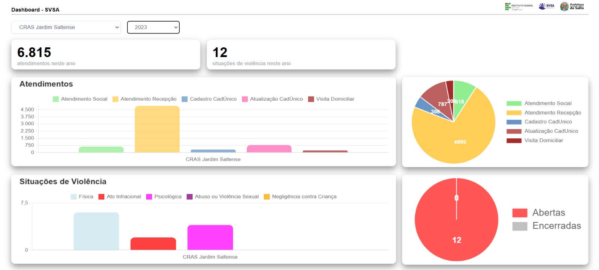

# TccDashboard

## 📜 Sobre este projeto

Este projeto foi desenvolvido durante o trabalho de conclusão de curso dos alunos Andre Franco e João Victor Araujo Corrêa. 

Este código refere-se ao frontend da solução decorrente deste TCC, que fornece um dashboard com dados gerenciais dos serviços de assistência social da Estância Turística de Salto, fazendo com que
os técnicos e gestores possam tomar decisões baseadas em dados concretos.

## ⚙️ Instalações necessárias

[Node](https://nodejs.org/en/download) - para instalar o Angular.

## 🛠️ Funcionalidades

* Visualizar dashboard geral (apresenta a quantidade de tipos de atendimento e situações de violência de todas as unidades sem um período de tempo definido).
* Visualizar dashboard específico (apresenta a quantidade de de tipos de atendimento e situações de violência de uma unidade no período de tempo escolhido pelo usuário).
* Descriptografa os dados que são recebidos pela API.

## 🧑‍💻 Pré-requisitos

Para executar este projeto no modo de desenvolvimento, você precisa de um ambiente básico para executar uma aplicação Angular.

### 📂 Clonando

`$ git clone https://github.com/JoaoVictorCorrea/tcc-dashboard.git`

`$ cd tcc-dashboard`

### ⚙️ Instalando dependências

`$ npm install`

### 🚀 Executando

Com todas as dependências instaladas e com o ambiente devidamente configurado, você pode executar a aplicação:

`$ cd tcc-dashboard`

`$ ng build`

``$ ng serve``

Após isso, navegue para 'http://localhost:4200/'

## 🔧 Implementado com

* Angular
* TypeScript
* ChartJs
* CryptoJs

## 🤝 Contribuindo

Você pode enviar quantos PRs quiser, ficaremos felizes em analisá-los e aceitá-los! E se tiver alguma dúvida sobre o projeto...

Me envie um email: correa.joaov25@gmail.com

Conecte-se conosco [LinkedIn André](https://www.linkedin.com/in/andre-franco07/) e [LinkedIn João](https://www.linkedin.com/in/joaovcorrea/)

Obrigado! 😉
